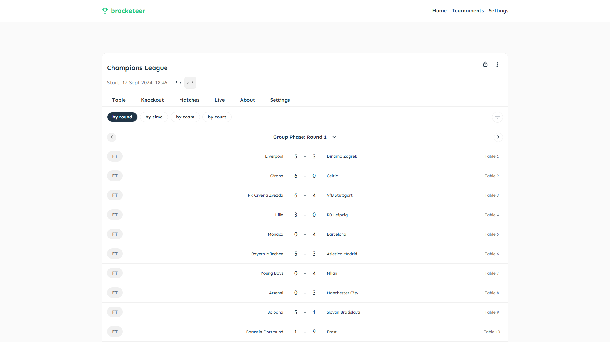

# bracketeer

[](https://sonarcloud.io/summary/new_code?id=davidohnee_bracketeer)

bracketeer is your sidekick for generating and managing tournaments for your social evenings. Whether you're organising a beer pong or foosball tournament, bracketeer ensures that it is well-structured and enjoyable.



## Features

- **Tournament Generation**: Quickly create brackets for any type of game.
- **Team Management**: Easily add, remove, and organise teams.
- **Sharing & Tracking**: Keep track of scores and progress in real-time.
- **Sets and Phases**: Easily test different tournament formats with support for sets and multiple phases.

### Sharing

Tournaments are stored locally in your browser. Please note that on WebKit-based browsers (e.g. Safari or iOS in general), [local storage is cleared after seven days of inactivity](https://webkit.org/blog/10218/full-third-party-cookie-blocking-and-more/), meaning your tournament will be lost if you don't access it within that time frame.

You can also share your tournament with others, specifically the match plan and scores.

#### GitHub Gists

You can share your tournament state with others through GitHub Gists. The host device does not need to be online for others to access the tournament, since the tournament state is stored in the Gist. However, please note that Gists are cached by clients for 5 minutes, meaning that changes made to the tournament may not be immediately visible to others. In order to share a tournament via a Gist, you will need to enter a GitHub personal access token.

#### Peer-to-Peer

Peer-to-peer sharing (powered by [PeerJS](https://peerjs.com/)) allows you to share your tournament state with others in real time. This means that changes made to the tournament are immediately visible to all participants. The host device must be online and connected to the internet for this to work. No login is required. P2P sharing is offered in three modes:

- **Permanent**: The link is valid whenever the host device is online. This means you can safely share the link in advance.
- **Session**: The link changes whenever the host device reopens the browser.
- **Random**: The link changes whenever the host device reloads or reopens the browser.

#### Using Gists and P2P sharing together

It is recommended to use Gists and P2P sharing together. Use the Gist share link to share the tournament with participants. bracketeer automatically switches to P2P sharing when available.

## Use

### Online

You can use bracketeer online [here](https://bracketeer.davidohnee.com/). This version is hosted via Cloudflare Pages.

### Self-Hosted

You can also self-host bracketeer using a reverse proxy such as [Caddy](https://caddyserver.com/) or [Nginx](https://nginx.org/). The application works client-side and offline.

## Contributing

Contributions are always welcome. If you are planning to use AI, please bear the following guidelines in mind:

- Vibe-coding is strongly discouraged.
- AI-assisted coding is allowed, but manual human review is required for all contributions (see [#43]).
- Tests can be generated with AI (as was done for the initial coverage, see [188c3af], [df7e37f], [095cf67]), but they must also be manually reviewed.

[#43]: https://github.com/davidohnee/bracketeer/pull/43
[188c3af]: https://github.com/davidohnee/bracketeer/commit/188c3af
[df7e37f]: https://github.com/davidohnee/bracketeer/commit/df7e37f
[095cf67]: https://github.com/davidohnee/bracketeer/commit/095cf67

### Development

#### Installation

Clone the repository:

```bash
git clone https://github.com/davidohnee/bracketeer.git
cd bracketeer
```

Install dependencies:

```bash
npm i
```

#### Usage

Run bracketeer

```bash
npm run dev
```

Open your browser and navigate to `http://localhost:5173` to access the application.

#### Testing

This project uses [Vitest](https://vitest.dev/) for unit testing. To run tests:

```bash
# Run tests in watch mode
npm test

# Run tests once
npm run test:run

# Run tests with UI
npm run test:ui

# Run tests with coverage
npm run test:coverage
```

#### Type Checking, Linting

```bash
# Type check
npm run type-check

# Lint code
npm run lint
```

## License

This project is licensed under the GPL-3.0 License. See the [LICENSE](LICENSE) file for details.

## Contact

For questions or feedback, please [create an issue](https://github.com/davidohnee/bracketeer/issues/new).
